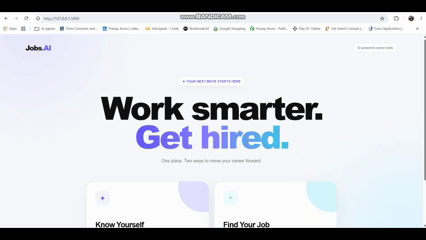

# Jobs.AI

### AI-Powered Resume Analysis & Job Matching

Jobs.AI is an intelligent job-search assistant that analyzes your resume, extracts relevant skills and information, and helps you discover job opportunities based on your profile.

The goal is simple:

> **Understand your resume. Find better jobs. Apply smarter.**

---

## 🎥 Demo


---

## ✨ Features

### 🧠 Resume Intelligence

Upload your resume and let Jobs.AI analyze it automatically.

- Resume PDF upload
- Automatic resume analysis
- AI-powered information extraction
- Skill extraction
- Personal information extraction
- Resume insights
- Persistent resume session
- Resume replacement and deletion

---

### 🔎 Intelligent Job Search

Use the information extracted from your resume to search for relevant job opportunities.

- Location-based job searching
- Resume-generated search keywords
- Editable search keywords
- Custom keyword searching
- Recent job listings
- Duplicate job removal
- Company filtering
- Role filtering
- Direct job listing links

---

### 📊 Job Matching

Jobs.AI is designed to evaluate how well a job matches your resume.

Each job can be evaluated against:

- Resume skills
- Job requirements
- Search keywords
- Missing skills
- Relevant experience

The matching engine is designed to become increasingly intelligent as the project evolves.

---

## 🏗️ Architecture

Jobs.AI keeps the application intentionally lightweight and modular.

```text
Jobs.AI
│
├── app.py
│   └── Flask application
│
├── ai.py
│   └── Qwen resume analysis
│
├── jobs.py
│   └── Job search & filtering
│
├── matcher.py
│   └── Resume ↔ Job matching
│
├── templates/
│   ├── index.html
│   ├── option1.html
│   └── option2.html
│
├── resumes/
│   └── Uploaded resumes
│
├── analysis/
│   └── Resume analysis JSON files
│
└── README.md
